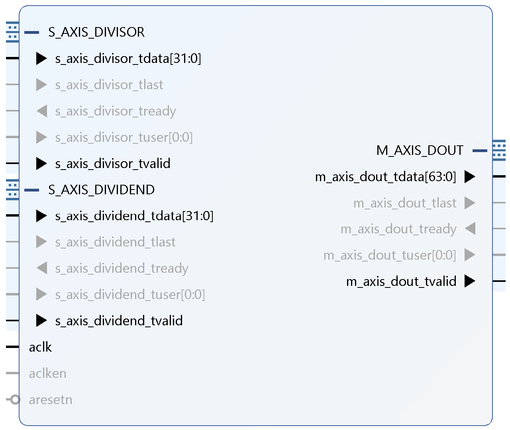

# Squishy Car

## Usage:

### Build (Locally)

vivado -mode batch -source build.tcl

### Flashing to FPGA

openFPGALoader -b arty_s7_50 obj/final.bit

### Simulating testbenches

#### Draw Polygon

iverilog -g2012 -o foo.out sim/draw_polygon_tb.sv hdl/draw_polygon.sv hdl/in_polygon.sv hdl/angle.sv

## IP

### Divider

The higher 32 bits of the output (i.e., [63:32]) is the quotient, and the lower 32 bits (i.e., [31:0]) is the remainder.

This module always has a latency of 36 clock cycles.